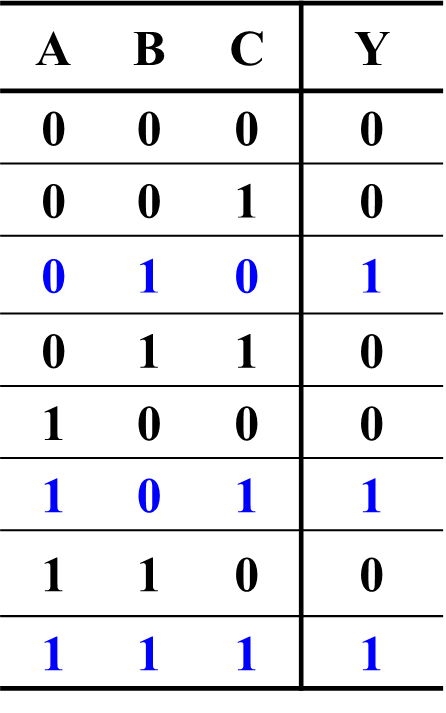
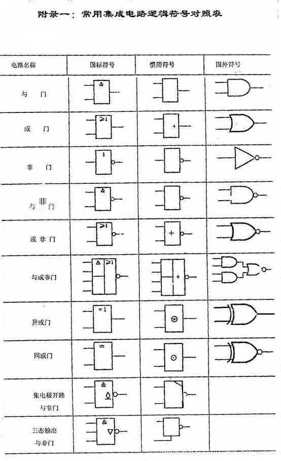
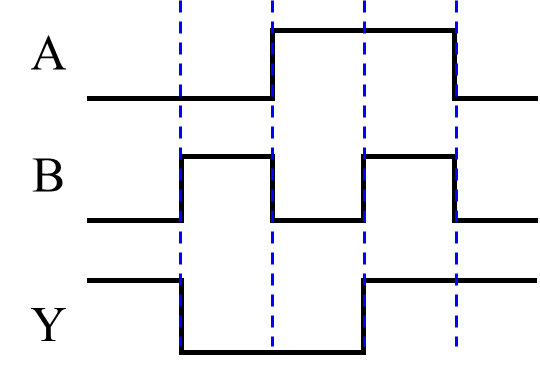
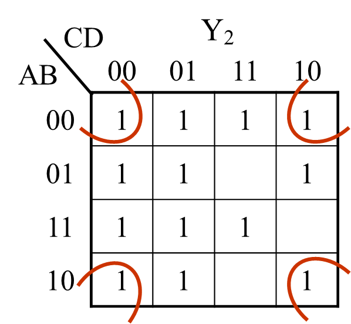
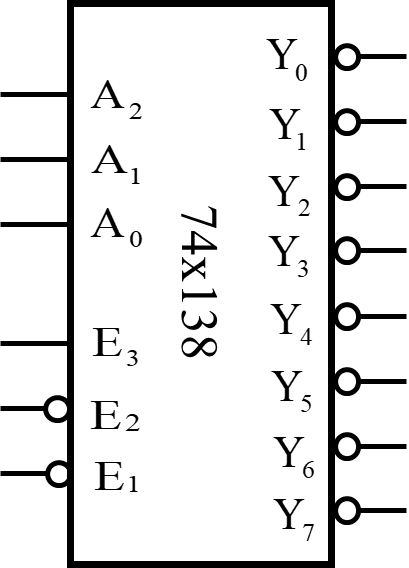
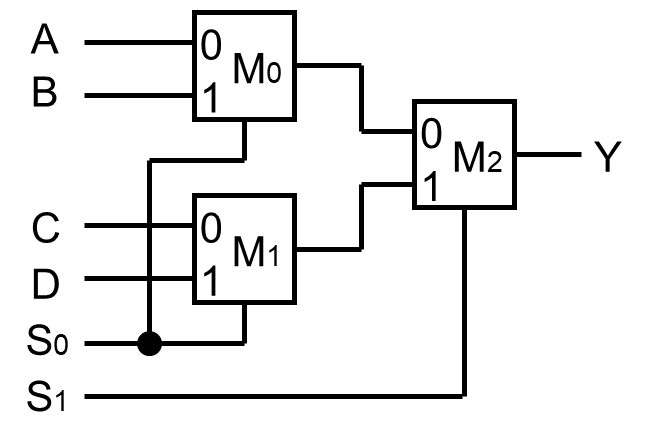
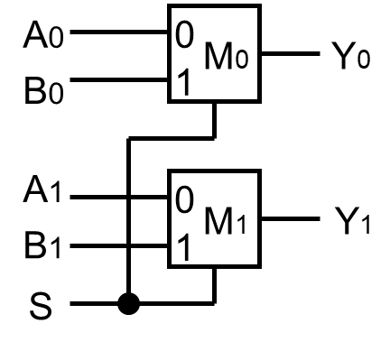
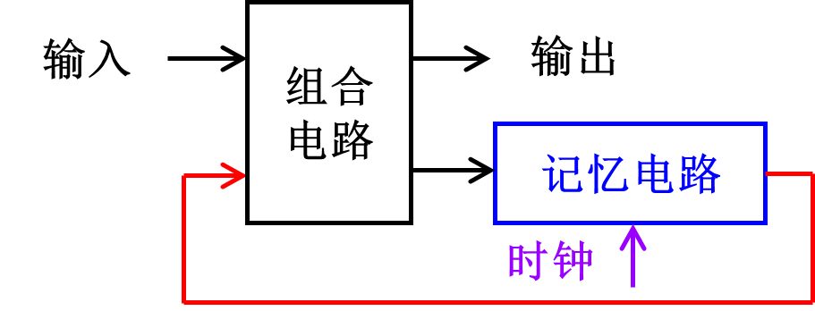
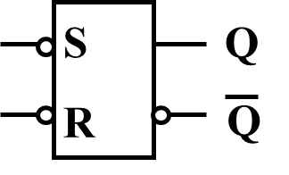

# 模数电路期中复习提纲
[toc]
## 数制与代码
### 数制
即用进位的方式来计数。R进制意为逢R进1。
我们常用的数制有：二进制、八进制、十进制、十六进制。

### 进制转换
**任意进制转十进制：** 各位按权相加。
如：$(1011.01)_2 = 1\times 2^3 + 0\times 2^2 + 1\times 2^1 + 1\times 2^0 + 0\times 2^{-1} + 1\times 2^{-2} = 11.25$
**十进制转其它进制：** 整数部分不断除以基数（R）取余数，先得到的是较低有效位，直到商为0为止。小数部分不断乘以基数取整数部分，先得到的为高位，直到小数部分为0为止。

这里小数部分的转换要注意**四舍五入**的问题，即看最后一次乘以基数后的小数部分是否大于0.5。

**二/八/十六进制互相转换：** **二进制转八/十六进制**只需将3/4位二进制位合在一起，转换为一个八/十六进制位即可。注意如果不够3/4位，整数部分高位补0，小数部分低位补0。**八/十六进制转二进制**只需将每一位转换为3/4位二进制位即可。**八进制和十六进制的互相转换**可以用二进制作为桥梁。

### 有符号数的编码
**原码：** 用最高位表示符号，其余位表示数值。如：$-5 = 10000101_2$，$+5 = 00000101_2$。
**反码：** 正数的反码与原码相同，负数的反码是对原码除符号位外各位取反。如：$-5 = 11111010_2$，$+5 = 00000101_2$。
**补码\*：** 正数的补码与原码相同，负数的补码是对原码除符号位外各位取反，然后加1。如：$-5 = 11111011_2$，$+5 = 00000101_2$。
- 对补码按位取反再加1可以求它的的**相反数**的补码。如：+5转换为补码是0101，对它按位取反再加1会得到-5的补码1011。**用这个性质可以将补码表示的负数转换回它的绝对值**，或是用加法实现减法。

补码是计算机中一个非常巧妙的设计。感兴趣的同学可以参阅这篇文章：https://blog.csdn.net/mkr67n/article/details/114701908

**判断补码加减法计算是否溢出：** 2种判别方法：
1. 同号相加，异号相减，结果与被加数/被减数符号位不同则溢出。
2. 最高位和次高位进位不同则溢出。
这里第二种方法只考虑了进位，因为补码的减法也会转换为加法进行运算。

### 其它二进制编码
**BCD码：** 用4位二进制数表示一个十进制数的一位，分为有权码和无权码。
- 有权码：每一位有固定的权值，有8421码、5421码、2421码等几种。这里的“abcd码”就是指4位二进制中从高到低每一位的权值分别为a、b、c、d。**如果没有特别说明，BCD码指的是8421码**（考试时如不确定可以询问助教）。
- 无权码：每一位没有固定权重，主要有余三码和余三循环码两种。余三码的每个十进制位对应的编码比8421码多3；余三循环码可以通过余三码转换，规则如下：
  设余三码为$D_3D_2D_1D_0$，则余三循环码为$\{D_3,D_3 \char`^D_2,D_2 \char`^D_1, D_1\char`^D_0\}$。

当然，期中考是开卷的，所以也可以查表：

**格雷码：** 任意两个相邻的数的二进制码只有一位不同（首尾两个码也只有1位不同）。格雷码和二进制码之间的转换主要通过异或操作实现。
设有n位二进制数$B_nB_{n-1}...B_2B_1$，和n位格雷码$G_nG_{n-1}...G_2G_1$，则有：
二进制转格雷码：$G_n = B_n, G_i = B_{i+1} \char`^ B_i(i=1,2,...,n-1)$
格雷码转二进制：$B_n = G_n, B_i = B_{i+1} \char`^ G_i(i=1,2,...,n-1)$

**ASCII码：** 7位二进制数表示128个字符。C语言中的char类型就是用ASCII码表示的，相信大家都很熟悉。

## 逻辑代数与逻辑运算
### 逻辑代数
又称布尔代数，是用一种数学运算来描述人的逻辑思维规律和推理过程的代数系统。在数字电路中，对逻辑代数的内容主要为逻辑运算和逻辑函数的表示。
- 逻辑变量：只有1和0两种取值。通常用1表示真，0表示假。
- 逻辑函数：用比较数学的方法来表示，那么逻辑函数就是一个$\{0,1\}^n \to \{0,1\}$的映射。简单的理解就是若干个逻辑变量经过一些逻辑运算后得到一个输出逻辑变量，对于每一组确定的输入，输出逻辑变量都有一个唯一确定的值。

### 逻辑运算
#### 基本逻辑运算
**与运算：** 又叫逻辑乘，用符号 $\cdot$ 表示（也可以省略）。输入同为1时输出1，否则输出0。
**或运算：** 又叫逻辑加，用符号$+$表示。输入同为0时输出0，否则输出1。
**非运算：** 又叫逻辑反，用符号$\overline{A}$（上加横线）表示。输入为1时输出0，输入为0时输出1。注意：$\overline{AB} \neq \overline{A}\ \overline{B}$。
#### 复合逻辑运算
**与非运算：** 即$\overline{AB}$，先与后非。
**或非运算：** 即$\overline{A+B}$，先或后非。
**异或运算：** 用符号$\oplus$表示，$A \oplus B = \overline{A}B+A\overline{B}$。输入不同时输出1，否则输出0。
**同或运算：** 即$\overline{A \oplus B}$，输入相同时输出1，否则输出0。
**与或非运算：** 有4个输入：$\overline{AB+CD}$

### 逻辑函数的表示
主要有4种方法：真值表，逻辑表达式，逻辑图，波形图。
#### 真值表
将逻辑函数的所有输入组合和对应的输出列成一张表格。例如：

#### 逻辑表达式
用逻辑运算符和逻辑变量还有括号组成的式子。例如：$F = \overline{A}B + AC + \overline{B}C$
#### 逻辑图
由逻辑符号及其相应连线构成的电路图。常用逻辑运算对应的逻辑符号如下：

#### 波形图
用高低电平按时间排列得到的波形表示逻辑函数的输入输出关系。例如：

#### 四种表示关系的转换：
转换关系相信大家经过作业练习已经相当熟悉了。这里简单概括下：
1. 真值表转逻辑表达式：将真值表中输出为1的乘积项（最小项）相加即可。
2. 逻辑表达式转真值表：遍历所有输入和对应输出，列成表格。
3. 逻辑表达式转逻辑图：将逻辑运算符用对应的逻辑符号表示，再按运算先后关系进行连线。
4. 逻辑图转逻辑表达式：按逻辑图的连线关系，从输出端开始，将逻辑符号转换回逻辑运算符，逆向推导出逻辑表达式。
5. 波形图转真值表：根据波形列出所有输入和对应输出。

### 逻辑代数基本定律和基本规则
#### 基本定律
$A\cdot0=0, \ A\cdot1=1 \\ 
A\cdot A=A,\ A+A=A \\
A\cdot \overline{A}=0,\ A+\overline{A}=1\\ 
\overline{\overline{A}}=A$
**交换律：** $A+B = B+A, AB = BA$
**结合律：** $(A+B)+C = A+(B+C), (AB)C = A(BC)$
**分配律：** $A(B+C) = AB+AC, A+BC = (A+B)(A+C)$
**德摩根定律（反演律）：** $\overline{A_1+A_2+...+A_n} = \overline{A_1}\ \overline{A_2}\ ...\ \overline{A_n},\quad \overline{A_1A_2...A_n} = \overline{A_1}+\overline{A_2}+...+\overline{A_n}$
**吸收律：** $A+AB = A, A(A+B) = A$
#### 基本规则
**代入规则：** 在任一逻辑恒等式中，若以一个逻辑表达式，代替恒等式两边所有出现的某一变量，则所得等式仍然成立。
**反演规则：** 将逻辑表达式中的与换成或，或换成与，1换成0，0换成1，原变量换为反变量，反变量换为原变量，可以得到原函数的反函数。
**对偶规则：** 将逻辑表达式中的与换成或，或换成与，1换成0，0换成1，可以得到这个表达式对应的对偶式。两个逻辑表达式相等，那么对偶式也相等。
注意：上面反演规则和对偶规则的替换必须保持原运算顺序。比如：$AB+CD$的对偶式是$(A+B)(C+D)$，而非$A+BC+D$。
#### 其他常用的公式
$A+\overline{A}B = A+B$
$AB+\overline{A}C+BC=AB+\overline{A}C$

### 逻辑函数的标准式
逻辑函数的表达方式有与或式、或与式、与非-与非式、或-非或非式、与或非式等多种。常用的是标准与或式和标准或与式。
#### 标准与或式
由若干个最小项相加构成的逻辑表达式。

**最小项**指包含所有输入变量的逻辑乘积项，每个变量以原变量或反变量的形式出现一次。如：$A\overline{B}C$。

最小项表达式可以利用$A+\overline{A}=1$通过代数法构造；也可列出真值表，然后将真值表中取值为1的行对应的最小项相加得到。

为方便，我们给每个最小项赋予一个编号。由于最小项的所有赋值方式中，只有一种赋值使它为1，其他赋值均为0，我们就取这种赋值为最小项的编号：即最小项中原变量取1，反变量取0得到的二进制数对应的十进制数。如：$A\overline{B}C$对应的编号为$2^2*1+2^1*0+2^0*1=6$。这样标准与或式也可以用最小项编号表示，如：$\overline{A}B\overline{C}+\overline{A}BC+A\overline{B}C = \sum m(2,3,6)$。

#### 标准或与式
由若干个最大项相乘构成的逻辑表达式。

**最大项**指包含所有输入变量的逻辑和式，每个变量以原变量或反变量的形式出现一次。如：$A+B+\overline{C}$。

最大项表达式可以利用$A\overline{A}=0$通过代数法构造；也可列出真值表，然后将真值表中取值为0的行对应的最大项相乘得到。

同样，我们给每个最大项赋予一个编号。一个最大项只有一种使它为0的赋值，我们就取这一赋值为它的编号：即最大项中**原变量取0，反变量取1**得到的二进制数对应的十进制数。如：$A+B+\overline{C}$对应的编号为$2^2*0+2^1*0+2^0*1=1$。这样标准或与式也可以用最大项编号表示，如：$(A+B+\overline{C})(A+\overline{B}+\overline{C})(\overline{A}+\overline{B}+C) = \prod M(1,3,6)$。

注意：最大项和最小项的编号规则是相反的。

#### 其他表示方式的求法
**与非-与非式：** 先求出与或式，对它取两次非，然后对内层使用一次摩根律。
例：$\overline{A}B + A\overline{C} = \overline{\overline{\overline{A}B + A\overline{C}}} = \overline{\overline{\overline{A}B} \ \overline{A\overline{C}}}$
**或非-或非式：** 先求出或与式，对它取两次非，然后对内层使用一次摩根律。
例：$(\overline{A}+B)(A+\overline{C}) = \overline{\overline{(\overline{A}+B)(A+\overline{C})}} = \overline{\overline{\overline{A}+B}+\overline{A+\overline{C}}}$
**与或非式：** 先求出反函数的与或式（对原函数的或与式用反演规则），然后取一次非。

### 逻辑函数的化简
#### 代数化简
反复利用各种基本定律消除多余的因子和乘积项。这种方式化简难度比较大，需要一定的“灵感”。因此更多情况下会使用卡诺图化简。
（考试应该不会考太难的代数化简，大家时间充裕的话可以用卡诺图验证一下代数化简是否正确）

#### 卡诺图化简
每一个最小项对应一个小方块，把这些小方块按逻辑和几何位置都相邻的方式排列，即相邻的两个最小项只有一个变量不相同。

注意，横坐标和纵坐标的编码排列需要满足相邻两项只有一位不同。
卡诺图化简对应步骤如下：
- 画出卡诺图的框架。
- 将逻辑函数中存在的或真值表中为1的最小项对应的方格填1，无关项填x，其余填0。
- 用尽可能少的包围圈将所有的1包围起来，每个包围圈尽量大。
- 将每个包围圈中不同的项消去，相同的项保留，得到对应的乘积项，再将所有乘积项相加即可。

一些注意事项：
- 卡诺图中最上面和最下面，最左边和最右边的方格也分别是相邻的，可以圈到一起。以及下面这种情况也可以圈到一起：
  
- 卡诺图的圈可以有重复元素。
- 无关项既可以看作0，也可以看作1，要充分利用。通常是利用无关项尽可能扩大每一个包围圈。
- 1很多的情况下也可以圈0得到反函数，再取反。

## 组合逻辑电路
组合逻辑电路可以理解为简单地用电路实现一个逻辑函数。其特点是没有记忆功能，任何时刻对相同的输入，输出都是相同的。并且其信号是单向传输的，不存在从输出端到输入端的反馈。

### 组合逻辑电路的分析
步骤如下：
- 将逻辑图转换为逻辑函数式
- 列出真值表
- 根据真值表概括其功能

分析电路功能确实比较困难，大家尽力就好。实在不会就把真值表列出来。

### 组合逻辑电路的设计

步骤如下：
- 根据要求确定输入和输出变量
- 列出真值表
- 根据真值表列出逻辑函数式
- 根据需要对逻辑函数式进行变换和化简（也可以直接根据真值表画卡诺图化简，然后给出最简与或式）
- 根据最后得到的逻辑函数式画出电路图

### 常用的组合逻辑电路
#### 编码器
将输入信号转换为二进制编码输出，称m个输入，n个输出的编码器为m线-n线编码器$(m>n)$。常见的有8线-3线，10线-4线等。按照功能，编码器可分为普通编码器和优先编码器。
**普通编码器：** 要求任意时刻只能有一个输入信号有效，多个输入有效的状态被看作无关项，输出无意义。这种编码器构造简单，但对输入信号要求高。
**优先编码器：** 优先编码器的输入信号可以同时有效，对优先级最高的信号进行编码。
编码器之间可以进行合适的组合进行扩展，比如如将两个8线-3线编码器组合成16线-4线编码器。

#### 译码器
功能和编码器相反，将二进制编码转换为高低电平组合状态，称m个输入，n个输出的译码器为m线-n线编码器$(m<n)$。
由于对每一种二进制编码，译码器只有一个输出有效，因此译码器可以用来实现逻辑函数的最小项表达式，只需将逻辑函数中的每个最小项对应的有效输出进行合适的与、或、非运算即可。比如，把下面这个译码器的$Y_0, Y_2, Y_6$进行与非，即可得到逻辑函数$F = \Sigma m(0,2,6)$。

有一类特殊的译码器叫显示译码器，作用是将二进制编码翻译成驱动七段数码管的显示信号。大家可以自己看ppt了解。

#### 数据选择器
根据选择信号，从多路输入中选择一路输出。通常是用n位选择信号选择$2^n$路输入。
数据选择器可以进行扩展，分为字扩展和位扩展两种。
**字扩展：** 增加选择信号的位数，使选择器可以选择更多的输入。通常用数据选择器级联实现。例如下面将3个二选一选择器级联，实现4选一选择器：

**位扩展：** 增加输入的位数，使选择器可以选择更长的输入。通常用数据选择器并联实现。例如下面将2个二选一选择器并联，实现2位4选一选择器：

数据选择器也可以用来实现逻辑函数。一种可行的实现方式是：如果输入位数不超过选择信号的位数，则将输入直接接入数据选择器的选择信号，然后根据逻辑函数的最小项表达式，将选择器输入信号中合适的位置接1，其余位置接0；如果输入位数超过选择信号的位数，那么就需要将逻辑函数的部分输入接到数据选择器的输入上。

#### 数据分配器
和数据选择器的功能相反，将一路输入分配到多路输出上。
译码器输出端的n条线中，每次只有一条有效，因此可以用译码器来实现数据分配器。

#### 比较器
判断二进制数大小关系的电路。通常有3个输出，分别表示大于、等于、小于这三种比较结果。
比较器也可以进行扩展实现更高位数的比较。根据所用的比较器的功能，有以下两种扩展方式：
- 如果比较器提供了输入低位比较结果的输入端，那么直接将低位比较器比较结果接入高位比较器，将最高位比较器的输出作为输出即可实现扩展。
- 如果比较器没有这种输入端，那么只能按照组合电路的设计方式，设计合适的组合电路来整合从低位到高位的多个比较器的输出，实现先比高位后比低位。

#### 加法器
实现加法运算的电路。最基本的加法器是1位的半加器和全加器。
**半加器：** 两个1位二进制数相加，得到和的低位，以及进位。
**全加器：** 两个1位二进制数以及上一位的进位相加，得到和的低位，以及进位。
将半加器和全加器串联，即可得到任意位数的串行进位加法器。
串行进位加法器每一位进位信号的产生都需依赖上一位的输出，因此速度较慢。**超前进位加法器**将进位信号用输入信号的函数来表示，无需等待低位的输出，速度快但结构复杂。

## PLD
可编程逻辑电路，可以由用户自定义逻辑功能。
PLD的基本结构如下：

相当于逻辑电路中的门电路已经放好（或者已连接了一部分），只需按照逻辑函数的与或式完成剩下部分的连接即可实现逻辑功能。
PLD主要分为以下几种：

## 时序逻辑电路
与组合逻辑电路相对应，时序逻辑电路具有记忆功能，可以存储电路当前所处的状态（其实就是组合电路+记忆单元）。输出也与当前状态有关，因此会有从输出到输入的反馈路径。

### 时序电路的分类
时序电路根据有无统一的时钟信号，可分为同步时序电路和异步时序电路两种。这门课程中涉及的主要是有统一的时钟信号的同步时序电路。
而根据输出信号的产生方式，时序电路可分为**米利（Mealy）型**和**穆尔（Moore）型**两种。其中米利型的输出由当前状态和当前输入决定，而穆尔型的输出仅有当前状态决定。

### 时钟信号
周期性的脉冲信号，也称时钟脉冲(CP)，简称时钟，用于控制记忆单元状态更新的时机
主要的参数有：周期（T）、频率（f）、脉冲宽度（$t_w$）、占空比（q）。它们之间的关系为：
$$f = \frac{1}{T}, q = \frac{t_w}{T}\times 100%$$

### 锁存器和触发器
锁存器和触发器是时序电路中记忆电路的组成部分。两者的区别在于锁存器是高低电平有效的，而触发器是时钟边沿有效的。

#### 锁存器
**基本SR锁存器：** 有S和R两个输入，S有效时置1，R有效时清零，均无效时保持不变，不能同时有效。

SR锁存器有很多种构成方式：

**门控SR锁存器：** 增加门控输入C，C有效时电路才会更新状态（此时仍要求SR不能同时有效），C无效时状态不变。

**D锁存器：** 有C和D两个输入。C无效时电路状态不变，C有效时电路状态跟随D变化

#### 触发器
**D触发器：** 时钟边沿才发生变化，其他功能与D锁存器一致。有上升沿变化和下降沿变化两种

**T触发器：** 时钟上升（下降）沿时，若输入T有效则触发器状态翻转，否则状态不变。

**JK触发器：** 有J和K两个输入，功能丰富，可以保持状态、置0、置1、翻转。

不同种类的锁存器（触发器）之间可以通过在输入位置添加合适的组合电路，来实现功能的转换。可以根据两种锁存器（触发器）的特性方程，求解转换电路的逻辑函数式

### 锁存器和触发器的动态特性
**建立时间$t_{su}$：** 要求输入信号在时钟有效边沿到来之前，提前一段时间做好准备。
**保持时间$t_h$ ：** 在时钟有效边沿到达后，需要输入信号再保持一段时间。
**传输延迟时间$t_{pd}$：** 输出信号对时钟信号响应的延迟时间。从低电平到高电平和从高电平到低电平的延迟时间可能不一样。

### 时序电路的描述
时序电路的描述方式有逻辑方程、状态转换表（状态表）、状态转换图（状态图）、时序波形图（时序图）、HDL描述等，不同描述方式之间是等价的。前面有提到时序电路有穆尔型和米利型这两种，它们在描述方式上也会有所不同。
#### 逻辑方程
分为激励方程、状态方程和输出方程。
**激励方程：** 就是触发器的输入方程。所用触发器有几个输入就有几个方程。是输入和当前状态的函数，形式为$Z = f(X, Q)$。
**状态方程：** 描述下一状态的逻辑函数，是输入和当前状态的函数，形式为$Q^{n+1} = f(X, Q^n)$。
**输出方程：** 描述输出的逻辑函数。对于米利型电路，输出方程是输入和当前状态的函数，形式为$Y = f(X, Q)$；对于穆尔型电路，输出方程是当前状态的函数，形式为$Y = f(Q)$。

#### 状态转换表
可以理解为状态方程和输出方程的真值表。米利型电路和穆尔型电路的状态转换表也有所区别：

#### 状态转换图
用有向图描述状态和状态之间的转换关系以及对应的输出。米利型电路和穆尔型电路的状态转换图也有所区别：

米利型电路的输出和输入有关，因此和输入写在一起；穆尔型电路的输出与输入无关，因此和状态写在一起。

#### 时序波形图
描述状态和输出信号波形随时钟信号、输入信号变化的波形图。

#### HDL描述
在这门课中就是用Verilog描述。这部分主要是实验的内容，在此不再赘述。

### 同步时序逻辑电路的分析
即从时序电路的描述中，分析出电路的功能。步骤如下：
- 根据逻辑图写出逻辑方程。可以先分析激励方程和输出方程，状态方程可以把激励方程代入触发器的特性方程得到。
- 列出状态表、画出状态图或时序图
- 确定电路的逻辑功能

时序逻辑电路的功能分析同样比较困难。无法完全确定功能也没关系，前面的步骤都有分。

### 同步时序逻辑电路的设计
即根据给定的要求设计满足要求的时序电路。步骤如下：
- 根据要求设计状态机，建立原始状态图/原始状态表
- 状态化简。等价的状态（在相同的输入下有相同的输出，且转换到相同的次态）可以合并。
- 状态编码。给每个状态赋予一个二进制编码，编码的位数由状态数决定。设状态数为m，则编码位数n通常需满足$2^{n-1} < m \le 2^n$。编码方式有顺序编码、循环码编码、独热码编码等。通常用顺序编码（状态从0至m-1编号，将编号用等值的二进制数码表示），但有时用循环码编码可以有效简化电路。独热码编码比较少见，如果不是题目要求的话不要折磨自己（
- 求解状态方程和输出方程。直接用传统的组合电路设计方法（列真值表，求逻辑函数）求解即可。
- 检查自启动。根据状态方程，画出包含无效状态的完整状态转换图，检查是否存在无效状态之间的循环，如果存在则需要修改状态方程，确保所有无效状态最终都能转移到有效状态。
- 选择触发器类型，确定激励方程。触发器类型可根据题目要求和设计方便性进行选择。激励方程的求解主要有以下两种方法：
  - 1. 将状态方程利用逻辑代数公式变形成和触发器特性方程一致的形式
  - 2. 利用激励表和状态表，求触发器输入端关于当前状态和输入的真值表，再用真值表求激励方程
- 画出逻辑图